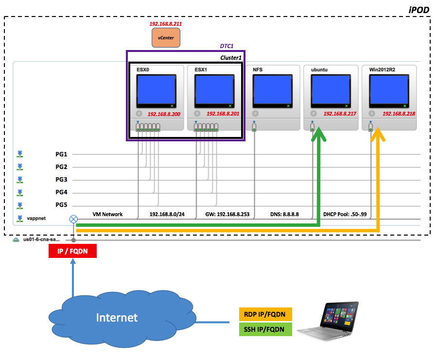

## Background

For those of you familiar with VMware Hands-on-Labs (HOLs) the notion and concept of a POD should not be anything new. A POD is an isolated (nested) environment with a specific stack meant to be used as a lab environment for short lives exercises. While these PODs can be accessed from the Internet, the POD itself doesn't have (outbound) Internet connectivity.

In a world where software updates are happening at a furious speed, and users would likely need to "pull" live from GitHub repos and/or Bintray to get the latest stuff to exercise their lab... a self-contained lab environment with no Internet connectivity could be sometimes limiting. Enter the `iPOD`.

## the iPOD

An iPOD (short for Internet POD) leverages most of the principles of standard PODs but do provide:
- (inbound) Internet connectivity into a Linux jump box (via SSH)
- (inbound) Internet connectivity into a Windows jump box (via RDP).
- (outbound) Internete connectivity for all of the components inside the iPOD.

Yes you can google stuff from within the iPOD and do everything you'd do from your laptop. The Windows and Linux instances inside the iPOD should be seen as extensions of your desktop in a way (e.g the Windows instance allows you to open the browser and connect to UIs of services running in your iPOD while the Linux instance allows you to ssh and use CLIs against them). Some people refer to these as "jump hosts".

As for regular HOL PODs, the iPOD is entirely built on top of the strong multi-tenancy capabilities of vCloud Director. The difference with the iPOD is that the vApp (the sandbox construct that defines the POD boundaries) is connected via an Edge gateway that has an Internet IP address. Discussing how this is configured is beyond the scope of this first version of the document. For now, we will focus more on how you can consume an iPOD.

## iPOD content

You could have pretty much what you want inside an iPOD (provided it could be run on a VMware virtualized infrastructure). The typical use case for an iPOD is to try and exercise a VMware stack (run nested).

An iPOD could support, for example:

- a plain vSphere stack
- a Photon Platform stack
- an entire SDDC stack
- and so forth

## iPOD multi-user support

It is up to the author of the iPOD to design the stack in a way that supports multiple concurrent users or assume there will be a 1:1 relationship between users and iPODs.

An iPOD could only be configured with 1 user while another iPOD could be configured to support multiple concurrent users (e.g. user1 through user<n>).

Since iPODs are very transient and likely to be used at community event a certain level of collaboration and trust can be assumed so, multi-user iPODs can be designed with weak boundaries among users. In this case users should be warned that a certain level of "behaviour" is required.   

## Automated iPOD deployment

Easy. There is none right now. It's all done manually.

An administrator with enough permissions will have to deploy the sandbox. Without getting into details of the mechanic of how this works, at the end of the provisioning process the administrator will know the (internet) IP address of the iPOD and will communicate this to the user. The user will then be able to RDP and SSH into the Windows and Linux VMs via the provided Internet IP address (or FQDN if available).

There are a ton of ways one can automate this process. None of them is implemented right now.

## vSphere 6.0 iPOD

For now, only a plain vSphere stack exists in the catalog. An administrator can provision multiple plain vSphere 6.0 iPODs.

vSphere 6.0 is the starting point, users can build on top of it as part of an exercise, POC, hackaton, you name it.

This POD is an ideal candidate for users that would like to test the deployment of things like vSphere Integrated Containers, VIO, vRealize Automation, vCloud Director and so forth.

The vSphere 6.0 iPOD includes 2 ESXi nested hosts and a vCenter running as a VM on top of the cluster they form.

This is a visual representation of the internals of the vSphere 6.0 iPOD.

This iPOD will be optimized in a future release by including vSphere 6.5, vSAN (as a replacement for the NFS VM) and Photon OS (as an alternative to the Ubuntu instance).

This POD has 5 users defined in it. They all share the same password. Where SSO is not used and users have been separately created, they all have the same password. The password is not documented here, it is provided by the author of the iPOD at the time of usage.

Note: if you happen to use this iPOD in multi-user mode mind that all users have near-root and near-administrator roles. This means everyone can see (and do) pretty much everything. Please be a good citizen.

The following users are defined on this iPOD.

### Linux virtual machine

- user1
- user2
- user3
- user4
- user5

### Windows virtual machine

- user1
- user2
- user3
- user4
- user5

### vCenter Server (192.168.8.211)

- user1@vsphere.local
- user2@vsphere.local
- user3@vsphere.local
- user4@vsphere.local
- user5@vsphere.local

## Photon Platform 1.1 iPOD

*coming soon*

